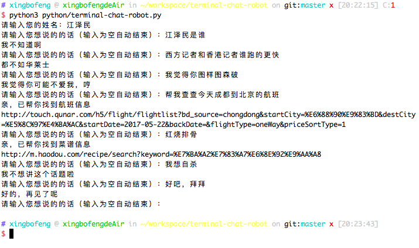
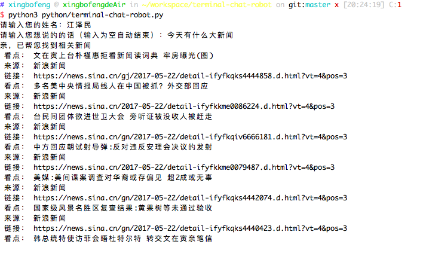

# terminal-chat-robot
It's a terminal robot which can chat with you.

Thanks for [tuling123 API](http://www.tuling123.com/help/h_cent_webapi.jhtml?nav=doc).

## Technology stack
* python3
* pip3

You should update the version of your `python`, this project is only supported `python3.x`.
## Enjoy
```bash
pip3 install terminal-chat-robot
terminal-chat-robot
```

## Screenshots




## LICENSE
[MIT](./LICENSE)